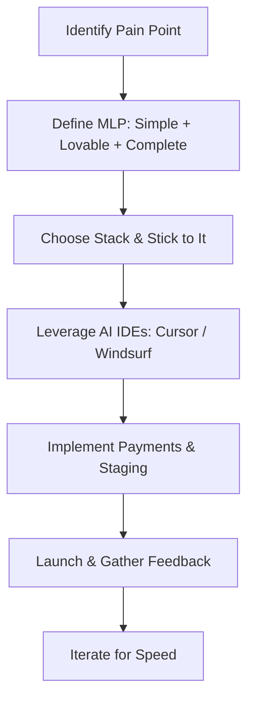

# App Development Knowledge Base
*Compiled from YouTube masterclasses, full courses, roadmaps, and solo dev strategies (React Native, Vibe Coding, Game Dev, Security, and Marketing).*

---

## 1. The Vibe Coding Paradigm & Modern Workflows

**Vibe Coding** represents a shift from writing manual syntax to orchestrating systems via LLMs (like Gemini, Claude Code, and Antigravity) through structured, iterative prompts.

### The Developer's New Role
*   **From Coder to System Architect:** The modern developer spends less time debugging semicolons and more time sketching out architectures, defining data models, and shepherding agents.
*   **Standard Operating Procedures (SOPs):** Agentic workflows are driven by plain-text guidelines. Every workflow or integration is documented in markdown (e.g., standard checklists, prompts, rules) so that agents can read it, execute the instructions, and verify results.
*   **Parallel Multi-Agent Execution:** In advanced environments like Antigravity, you can run multiple agent threads concurrently (e.g., one agent building the database schemas, another styling the front-end components, and a third drafting emails).

### The Developer-Agent Feedback Loop
*   **Local Execution & Previews:** Your codebase lives on your local machine. When building mobile apps with Expo/React Native, the **Metro Bundler** runs your app locally, allowing you to preview changes instantly in simulators (like an iOS simulator or Android Studio) or on physical devices.
*   **The Iterative Cycle:** Work systematically in a loop:
    1.  *Prompt:* Instruct the agent to build a specific component or feature.
    2.  *Execute:* The agent writes/creates the necessary local files.
    3.  *Test:* Preview the app locally, test interactions, and inspect states.
    4.  *Refine:* Feed errors or visual adjustments back into the prompt, and let the agent adapt.

### Advanced Skills for the "Agent Native" Developer
To stand out in the era of AI engineering, you must become "agent native"—mastering the skills required to steer agents at maximum efficiency:
*   **Prompt Queuing:** Learn to queue multiple unrelated requests sequentially instead of waiting for the agent to finish before writing the next instruction.
*   **System and Environment Control:** Equipping agents with local permissions (such as opening browser tabs, organizing file systems, or running terminal commands) allows them to work directly in your local environment.
*   **Bypassing Limitations with Custom Skills:** Create repeatable instruction templates (custom markdown guidelines or skills) for your agents. Once defined, you can invoke these skills by name to skip setup steps.
*   **Prompting API Integrations:** When adding APIs (like ChatGPT or Clerk), prompt the agent to write mock payloads and error-handling routines before hooking up the live endpoints.

### Multi-Agent Collaborations (Antigravity SDK)
*   **Collaborative Planning:** The Antigravity SDK enables multi-agent interactions where agents with distinct profiles can network, collaborate, and partition a complex project into subtasks.
*   **Digital Simulated Worlds:** Virtual agents can interact in sandbox environments (like the "Antigravity Orbits" space station demo), exchanging real-time status updates, dividing workloads, and checking each other's output (similar to peer PR reviews).
*   **Scaling Task Solving:** Apply multi-agent planning to any project requiring planning, code execution, visual design, and verification working in tandem.

### Maximizing the AI Iteration Loop
*   **Escape "Tutorial Hell":** Copying code verbatim tricks your brain into thinking you've learned. Instead, for every block of code generated or suggested:
    1.  Ask yourself: *"Do I understand what this function, hook, or variable is storing?"*
    2.  If not, go straight to the official documentation—treat it as the source of truth.
*   **Fast Deployments for Rapid Feedback:** Connect your code repository to platforms like Vercel or Netlify. The faster your code is deployed to a staging URL, the faster you can verify issues, test layouts on mobile devices, and feed runtime logs back into your agents for immediate debugging.

---

## 2. Choosing the Right Tech Stack

Choosing popular, well-supported technologies makes it significantly easier for AI agents to help you, as their training data is rich with examples and community solutions.

### Solo Dev / SaaS Stack Recommendation
| Layer | Technology | Rationale |
| :--- | :--- | :--- |
| **Web Frontend/Backend** | **Next.js + Vercel** | Server-side rendering (SSR), clean routing, and instant deployments. |
| **Mobile App Development** | **Expo + React Native** | Build cross-platform (iOS and Android) from one unified codebase. |
| **Backend & Storage** | **Supabase or Firebase** | Handles authentication, relational/NoSQL databases, and storage. |
| **Styling** | **Tailwind CSS / NativeWind** | Expressive utility-first styling that translates seamlessly from web to mobile. |
| **Analytics** | **PostHog** | Essential for tracking feature usage, lead sources, and conversion metrics. |
| **Error Tracking** | **Sentry** | Catches crashes and runtime errors immediately on user devices. |

### Mobile Game Development: Prebuilt Engines vs. UGC
If you want to start building games, you have three pathways:
1.  **User-Generated Content (UGC) Platforms (Roblox, Fortnite/UEFN):** *Recommended for complete beginners.* 
    *   **Pros:** Game assets, hosting, multiplayer netcode, and databases are completely free and pre-integrated. You focus purely on level design, mechanics, and scripting.
    *   **Cons:** Limited to the host platform's ecosystem and monetization terms.
2.  **Pre-built Game Engines (Unity, Godot, Unreal):** *Recommended for custom solo games.*
    *   **Unity:** The industry favorite for mobile games due to its massive community, learning resources, and asset store.
    *   **Godot:** Quirky but highly efficient, open-source, and seeing a massive influx of developers for 2D/light-3D games.
    *   **Unreal:** The standard for high-fidelity, graphically intensive 3D rendering.
3.  **Building Your Own Engine:** **DO NOT DO THIS** as a beginner. It distracts from actually shipping a game.

---

## 3. Foundational Roadmap for Solo Developers

Success as a solo developer requires prioritizing *MLP* over *MVP* and focusing on solving painful problems.



### The MLP Formula (Minimum Lovable Product)
*   **Simple:** Focus on 1 or 2 core features. Strip away everything else.
*   **Lovable:** Ensure the UI/UX is clean, professional, and pleasant to use.
*   **Complete:** Ensure those core features work flawlessly. Do not ship broken flows.

### Roadmap Milestones
1.  **Language Basics (1-2 Months):** Dedicate 3 to 5 hours daily to learn programming fundamentals (JavaScript/TypeScript for React Native; Dart for Flutter).
2.  **Version Control (1 Week):** Master Git using the 80/20 rule. Focus on branching, committing, merging, and pull requests.
3.  **Data Structures & Algorithms:** Do not skip. Even basic applications require clean data relationships. 
4.  **Design Patterns:** Learn classic patterns (e.g., Gang of Four). Frameworks like React Native and Flutter use them heavily under the hood.

---

## 4. Critical Security Practices in Vibe Coding

Vibe-coded apps have a notorious reputation for security leaks. AI agents will easily write functioning code, but they do not automatically audit security unless directed.

> [!WARNING]
> **The RLS (Row-Level Security) Trap**
> In platforms like Supabase and Firebase, Row-Level Security acts as a database filter. If RLS is misconfigured or disabled, **any user can access, modify, or delete your entire database.**
> Always enable RLS, set precise rules (e.g., `auth.uid() = user_id`), and run audit tools on your database schemas.

### Security Checklists for AI Code
*   **Never Call Paid AI APIs from the Frontend:**
    *   *Bad:* Calling OpenAI or Vertex AI directly from your frontend code. Anyone can open the browser console, steal your API key, and run up a massive bill.
    *   *Good:* Route all third-party API calls through serverless backend functions (Next.js API routes or Supabase Edge Functions) that hold your secret keys securely in `.env` files.
*   **Implement Server-Side Rate Limiting:**
    *   Never trust frontend limits. A user can easily bypass a frontend button block by scripting requests directly to your backend endpoint.
    *   Use database-level or memory-level rate limits per user ID / IP.
    *   Do not store rate-limiting logs on the same table as user data to avoid write locks and performance bottlenecks.
*   **Always Set Cloud Budget Caps:**
    *   Set strict hard caps on your OpenAI, Google Cloud, and AWS bills. If you hit the cap, your service goes down, which is infinitely better than waking up to a $50,000 bill.

---

## 5. Mobile Game Design & Engagement Psychology

Mobile games compete with infinite scroll feeds for attention. You must hook, retain, and monetize your players without driving them away.

### The First Two Minutes
*   **No Main Menus or Tutorials:** Do not make players click through configurations, settings, or generic menus. Throw them directly into the core gameplay loop within seconds of launching the app.
*   **Teach, Don't Preach:** Instead of pausing gameplay to show long text tutorials, teach mechanics one-by-one using easy wins that build confidence.

### "Game Juice" (Polish that Brain-Tickles)
Juice refers to visual and audio feedback that does not change gameplay mechanics but makes the game feel high-quality and satisfying:
*   Juicy sound effects on coin collection.
*   Smooth camera shakes on impact/hits.
*   Satisfying level-up popups and particles.
*   Stretch-and-squish animations on sprite movement.
*   Swipe trails on drag-and-drop elements.

### The Daily Habit Loop
*   **Push Notifications:** Use smart, non-intrusive notifications ("We miss you, come back!") to remind players of the app.
*   **Pigeon-Box Rewards:** Give players small, variable rewards for logging in daily.
*   **Monetization Timing:** Make the game fun first; only introduce monetization once the player is hooked. Never show ads in the first few minutes of gameplay, and use rewarded ads (watch an ad to get a revive/bonus) over intrusive popups.

---

## 6. Monetization, Economics & Solo Marketing

Building a product is only half the battle. Marketing and monetization are what turn a project into a profitable business.

```
                  ┌───────────────────────────────┐
                  │      VALUED APP IDEA          │
                  │  (Solves Pain / Saves Time)  │
                  └──────────────┬────────────────┘
                                 │
                                 ▼
                  ┌───────────────────────────────┐
                  │     PRICING DECISION          │
                  │   (One-Time vs. Subscription) │
                  └──────────────┬────────────────┘
                                 │
                                 ▼
                  ┌───────────────────────────────┐
                  │       PAYMENT GATEWAY         │
                  │ (Lemon Squeezy, Paddle, Stripe)│
                  └──────────────┬────────────────┘
                                 │
                                 ▼
                  ┌───────────────────────────────┐
                  │     HIGH-CONVERTING LANDING   │
                  │  (Hook -> Value -> Social)    │
                  └──────────────┬────────────────┘
                                 │
                                 ▼
                  ┌───────────────────────────────┐
                  │        MARKETING CHANNELS     │
                  │ (Short Video / Reddit Alerts) │
                  └───────────────────────────────┘
```

### Monetization Models
*   **One-Time Payments:** Highly preferred by customers today due to subscription fatigue. Great for generating quick upfront capital.
*   **Subscriptions:** Best for recurring revenue, but harder to maintain. Introduce subscriptions once you offer continuous value (e.g., servers, dynamic API costs, updates).
*   **Merchant of Record (MoR):** Platforms like **Lemon Squeezy** and **Paddle** handle global sales tax compliance, refunds, and subscriptions. This saves solo developers massive administrative headaches compared to raw Stripe integrations.

### High-Converting Landing Page Structure
1.  **Clear & Compelling Headline:** A 5-second value proposition (what your app does and who it is for).
2.  **Subheadline:** Highlights how the app solves their specific pain point.
3.  **Call to Action (CTA):** A prominent, high-contrast button (e.g., "Start Free").
4.  **Social Proof:** Testimonials, reviews, or user ratings to build immediate trust.
5.  **Pricing Cards:** Clear, transparent packages showing exactly what is included.

### Solo Marketing Playbook
*   **Reddit Keyword Alerts:** Use tools to monitor Reddit for keywords related to the problem your app solves. Enter discussions, provide genuine value first, and leave a link to your product as a solution.
*   **Short-Form Video (TikTok & Instagram Reels):** Remake and repurpose content formats that are already working for similar apps. Keep the hook within the first 3-5 seconds.
*   **Relentless Iteration:** Add a feedback button directly inside your app to let users email you. Prioritize updates based on **impact** (how much value does this bring?) vs. **effort** (how long does this take to build?).
